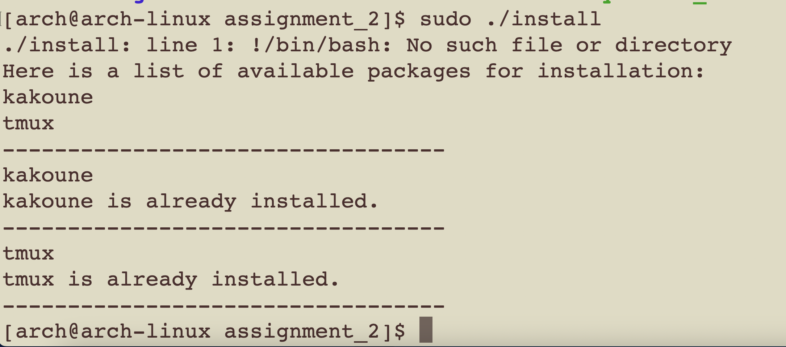
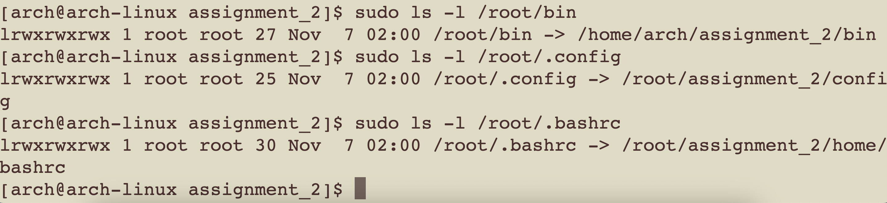

# Project 1
This project contains three script:
1. install 
2. symbolic_link
3. main

## Script 1: install script
This is a script that display and install packages. It performs the following tasks:
1. Displays to the user a list of available packages to be installed.
2. Checks if each package is already installed.
3. If not installed, install packages using pacman.

To run this script, execute the following in your terminal:

```
sudo ./install
```



## Script 2 symbolic_link script
This is a script that checks and creates symbolic links for specific files and directories. It performs the following tasks:
1. Checks if a symbolic link exists for the following:
 - ~/bin
 - ~/.config
 - ~/.bashrc
2. If not creates a symbolic link that points to a specific 
To run this script, execute the following in your terminal:
```
sudo ./symbolic_link
```
Verify Links:


## Script 3: main script
The main script act as a caller script by using getopts to provide user two option: 
1. Install packages 
2. Create symbolic link. 

It performs the following tasks:
1. Check if user have root priviledge.
2. A usage function that display user guide for the user.
3. Parsing options using getopts.
 - -i: Run the install script to display and install packages 
 - -s: Run the symbolic_link script to create symbolic links 

 To run this script, execute the following in your terminal:

 ```
 sudo ./main -i
 ```
 or

 ```
 sudo ./main -s

 ```