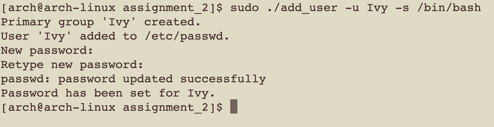

# Project 2: add_user script
This script will create a new user with a specified shell, a home directory created and add the user to addtional groups. It perform the following task:
1. Check for root privileges.
2. A usage function that display a guide for the user.
3. Parsing options using getopts.
 - -u username
 - -s shell
 - -h home_dir
 - -g group1 group2 ... (note here groups should be separated by space, not comma.) 
 4. Check for duplicate user exist.
 5. Create a home directory.
 5. Generate uid and gid.
 6. Create a unique primary group that match username.
 7. Add the user to additional group.

Example usage:
```
sudo ./add_user -u Ivy -s /bin/bash
```



